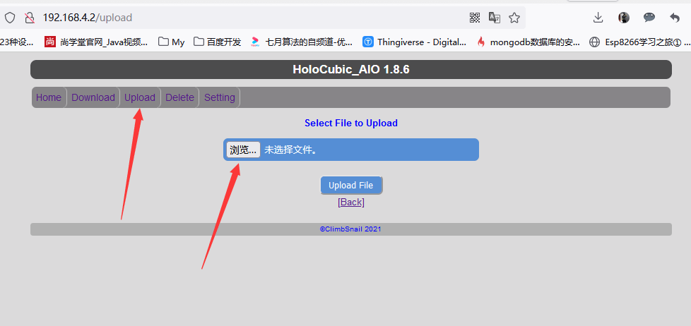

# HoloCubic_AIO (All in one for HoloCubic)

* 原作者的项目链接 https://github.com/peng-zhihui/HoloCubic
* 本项目的地址 https://github.com/ClimbSnail/HoloCubic_AIO （最新版本）
* 或者 https://gitee.com/ClimbSnailQ/HoloCubic_AIO

_**欢迎加入QQ讨论群 755143193**_

### 本固件程序的实现是基于前人的UI与灵感，设计了一套低耦合框架，更有利于多功能的实现
B站功能演示视频链接 https://www.bilibili.com/video/BV1jh411a7pV?p=1

[^_^]:
	

[^_^]:
	

[^_^]:
	

[^_^]:
	

### 主要特点
1. 内置天气、时钟、相册（tf卡）、浏览器文件修改等功能。
2. 开机无论是否连接wifi（一定要2.4G的wifi），都不影响其他功能运行。
3. 程序相对模块化，低耦合。
4. 提供web界面进行配网以及其他设置选项。注：若当前模式为STA模式，则WebServer建立在STA模式下的Local_IP上。若为AP模式，则建立在AP_IP上（屏幕的服务界面有标注），AP模式的热点名为`HoloCubic_AIO`无密码。
5. 提供web端连入除了支持ip访问，也支持域名直接访问 http://holocubic
6. 提供web端的文件上传到SD卡（包括删除），无需拔插SD来更新图片。
7. 即使断网后，时钟也依旧运行。（开机最好连接wifi，这样会自动同步时钟。使用中会间歇尝试同步时钟）

### 功能切换说明：
1. TF卡的文件系统为fat32。在使用内存卡前最好将本工程中`放置到内存卡`目录里的所有文件和文件夹都放在TF卡的根目录。
2. 插不插tf内存卡都不影响开机，但影响相册照片的读取。
3. 左右摇晃即可切换界面。
4. 向前倾斜1s钟即可切换第二功能，今后还会整合更多功能，同样前倾1s即切换。

知心天气的key（私钥）。（申请地址 https://seniverse.com ，文件里附带key是范例，无法直接使用。程序默认使用的是v3版本的api）

### TF卡文件说明
* 关于视频（暂时不可用）：运行播放器APP后，将会读取`movie/`目录下的视频文件。
* 关于天气：程序启动后在天气的界面时，将会读取`weather/`目录下的图标文件。
* 关于相册：运行图片APP后，将会读取`image/`目录下的图片文件。

关于图片转换：有空会出图片转换的工具。目前先自行手动转化(尺寸240*240)，常用的天气图片利用lvgl的官方转换器 https://lvgl.io/tools/imageconverter 转换为c数组，格式为Indexed 16 colors。不常用的图片则可以转换成bin文件存储到SD卡中，这样可以省下一些程序存储空间用来增加功能。

应用图标：可以下载阿里矢量图 https://www.iconfont.cn/

### 固件更新：
1. `bootloader_dio_40m.bin`启动的`bootloader`。
2. `partitions.bin`分区文件
3. `boot_app0.bin`
4. 最新的固件`HoloCubic_AIO_XXX.bin`

其中`HoloCubic_AIO_XXX.bin`文件随着每次版本更新而更新，其他三个文件基本不会变动。

将以上四个文件与`cubic_tool.exe`放在同一个目录下，双击运行`cubic_tool.exe`即可刷写固件。

### 硬件相关
**注意：硬件部分C7电容换成1uF左右就可以实现自动下载。**

### 关于编译工程代码
1. 本工程代码是基于vscode上的PlatformIO插件中的ESP32-Pic的Arduino平台开发。
2. 记得修改工程下`platformio.ini`文件中`upload_port`字段成对应自己COMM口。
3. 开发时，需要修改platformIO上对esp32的默认分区（否则编译大小超限，强制报错）。需要修改的文件为`.platformio/packages/framework-arduinoespressif32/boards.txt`，修改其中的`pico32.upload.maximum_size`字段的值为`2097152`（2M）够用就行。
4. 然后这里需要修改一个官方库文件才能正常使用：

首先非PlatformIO开发（自带包了）的用户需安装ESP32的Arduino支持包（百度有海量教程）。然后在安装的支持包的`esp32\hardware\esp32\1.0.4\libraries\SPI\src\SPI.cpp`文件中，**修改以下代码中的MISO为26**：

    if(sck == -1 && miso == -1 && mosi == -1 && ss == -1) {
        _sck = (_spi_num == VSPI) ? SCK : 14;
        _miso = (_spi_num == VSPI) ? MISO : 12; // 需要改为26
        _mosi = (_spi_num == VSPI) ? MOSI : 13;
        _ss = (_spi_num == VSPI) ? SS : 15;
这是因为，硬件上连接屏幕和SD卡分别是用两个硬件SPI，其中HSPI的默认MISO引脚是12，而12在ESP32中是用于上电时设置flash电平的，上电之前上拉会导致芯片无法启动，因此我们将默认的引脚替换为26。

### 程序框架图

[^_^]:
	
	

AIO框架讲解链接 https://www.bilibili.com/video/BV1jh411a7pV?p=2

关于UI的设计可以自行关注下`gui-guider`工具。

### 资料
ESP32内存分布 https://blog.csdn.net/espressif/article/details/112956403

### 版本更新日志

##### HoloCubic_AIO固件_v1.4.bin
1. 大量修改程序框架。
2. 增加屏幕亮度。
3. 修改原相册切换时"白屏"现象。
##### HoloCubic_AIO固件_v1.3.bin
1. 将wifi配置信息从内存卡移到flash中，实现非相册功能的应用无需依赖内存卡。开机需要使用里面的配置APP在浏览器端配置网络信息。后期升级固件无需重新配置信息。
2. 调整RBG氛围灯。
3. 增加内存卡中的`movie`目录（便于后期拓展）。

