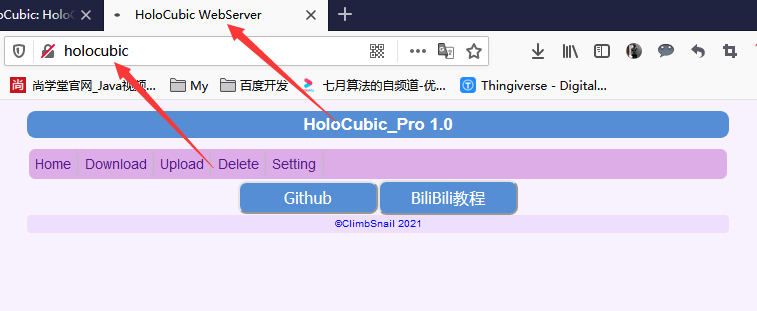
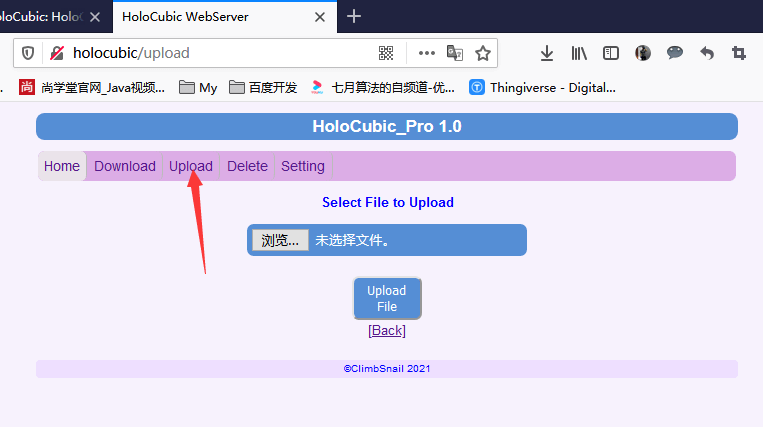

# HoloCubic
HoloCubic Firmware

* 原作者的项目链接 https://github.com/peng-zhihui/HoloCubic
* 本项目的地址 https://github.com/ClimbSnail/HoloCubic
* 或者 https://gitee.com/ClimbSnailQ/HoloCubic

注意：硬件部分C7电容换成10uF左右就可以实现自动下载。

### 本固件程序是基于前人的基础上修改了整体框架，更有利于多功能的实现

##### 主要特点
1. 程序相对模块化，低耦合。
2. 提供web界面进行配网以及其他设置选项。注：若当前模式为STA模式则WebServer建立在STA模式下的AP_IP上，若为AP模式，则建立在Local_IP上（屏幕的服务界面有标注）
3. 提供web端连入除了支持ip访问，也支持域名直接访问 http://holocubic
4. 提供web端的文件上传到SD卡（包括删除），无需拔插SD来更新图片。

##### 目前已完成的功能：
1. 左右摇晃即可切换界面。
2. 向前倾斜1s钟即可切换第二功能，今后还会整合更多功能，同样前倾1s即切换。

##### 之后计划
1. 添加视频播放。
2. 电脑桌面投屏。

本工程代码是基于vscode上的platformIO插件开发的，开发时请改动`platformio`中的`upload_port`参数。需要修改platformIO上对esp32的默认分区（否则编译大小超限，强制报错）。

**然后这里需要修改一个官方库文件才能正常使用：**

首先肯定得安装ESP32的Arduino支持包（百度有海量教程），然后在安装的支持包的`esp32\hardware\esp32\1.0.4\libraries\SPI\src\SPI.cpp`文件中，**修改以下代码中的MISO为26**：

    if(sck == -1 && miso == -1 && mosi == -1 && ss == -1) {
        _sck = (_spi_num == VSPI) ? SCK : 14;
        _miso = (_spi_num == VSPI) ? MISO : 12; // 需要改为26
        _mosi = (_spi_num == VSPI) ? MOSI : 13;
        _ss = (_spi_num == VSPI) ? SS : 15;
这是因为，硬件上连接屏幕和SD卡分别是用两个硬件SPI，其中HSPI的默认MISO引脚是12，而12在ESP32中是用于上电时设置flash电平的，上电之前上拉会导致芯片无法启动，因此我们将默认的引脚替换为26。

内存卡文件系统为fat32，将`放置到内存卡`目录里的所有文件和文件夹都放在TF卡的根目录。

关于`wifi.txt`文件的结构一共5行（每一行一定要加回车，最后一行也必须有回车）：
1. wifi名称
2. wifi密码
3. 所在省份（用于天气查询）
4. 上述省份的语言（默认使用zh-Hans 简体中文）
5. 知心天气的key。（申请地址 https://seniverse.com ，文件里附带key是范例，无法直接使用。程序默认使用的是v3版本的api）

关于天气：程序启动后在天气的界面时，将会读取`Weather/`目录下的图标文件。

图片转换：有空会出图片转换的工具。

